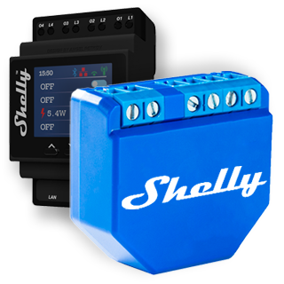

# ioBroker.shelly

## Versions

The adapter communicates with Shelly devices by REST API and the CoAP or MQTT protocol.

It uses the default Shelly firmware (no flashing of firmware needed!). You will find more and detailed information about the device here: [Shelly](https://shelly.cloud/)

## Documentation

[🇺🇸 Documentation](./docs/en/README.md)

[🇩🇪 Dokumentation](./docs/de/README.md)

### Bluetooth Low Energy (BLU)

**Experimental** - see [documentation](https://github.com/iobroker-community-adapters/ioBroker.shelly/blob/master/docs/en/ble-devices.md) for details (Shelly Scripting required)

Adapter version >= v6.6.0 required!

- BLU Button 1,
- BLU Door/Window
- BLU Motion

## NOT Supported devices

- Shelly Plus Wall Dimmer US
- Shelly Plus Plug US
- Shelly Pro EM 2x50A
- USB powered UVC LED strip

## Sentry

**This adapter uses Sentry libraries to automatically report exceptions and code errors to the developers.** For more details and for information how to disable the error reporting see [Sentry-Plugin Documentation](https://github.com/ioBroker/plugin-sentry#plugin-sentry)! Sentry reporting is used starting with js-controller 3.0.

## Troubleshooting after installation

### TypeError: xmlserializer.Builder is not a constructor

execute

`cd /opt/iobroker/node_modules/iobroker.shelly npm install xml2js@0.4.23`

## Changelog

<!--
  Placeholder for the next version (at the beginning of the line):
  ### **WORK IN PROGRESS**
-->
### 6.7.0 (2023-12-22)

* (klein0r) Updated handling of ble payloads
* (D1gitaldad) Added Shelly Wall Display

### 6.6.1 (2023-10-20)

* (klein0r) Fixed stop reason for Shelly 2.5 / Shelly 2
* (klein0r) Added humidity of Shelly Plus Addon
* (klein0r) Not all devices have external power

### 6.6.0 (2023-10-17)

* (klein0r) Added BLE devices as states to `shelly.0.ble.*` (Shelly Scripting required)

### 6.5.0 (2023-10-17)

* (klein0r) Added Shelly Plus Smoke
* (klein0r) Added Shelly Bluetooth Low Energy Gateway
* (theimo1221) More Shelly TRV Datapoints

### 6.4.5 (2023-09-26)

* (klein0r) Added Shelly Pro Dual Cover/Shutter PM
* (klein0r) Added Shelly Pro 3 EM 400A
* (JuniperChris929) Added support of Shelly Plus 1 Mini + Shelly Plus 1 PM Mini
* (BooosesThaSnipper) Added support of Shelly Plus AddOn for Gen2 Devices.
* (D1gitaldad) Added support of Plus PM Mini

## License

The MIT License (MIT)

Copyright (c) 2018-2023 Thorsten Stueben <thorsten@stueben.de>,
                        Apollon77 <iobroker@fischer-ka.de> and
                        Matthias Kleine <info@haus-automatisierung.com>

Permission is hereby granted, free of charge, to any person obtaining a copy
of this software and associated documentation files (the "Software"), to deal
in the Software without restriction, including without limitation the rights
to use, copy, modify, merge, publish, distribute, sublicense, and/or sell
copies of the Software, and to permit persons to whom the Software is
furnished to do so, subject to the following conditions:

The above copyright notice and this permission notice shall be included in
all copies or substantial portions of the Software.

THE SOFTWARE IS PROVIDED "AS IS", WITHOUT WARRANTY OF ANY KIND, EXPRESS OR
IMPLIED, INCLUDING BUT NOT LIMITED TO THE WARRANTIES OF MERCHANTABILITY,
FITNESS FOR A PARTICULAR PURPOSE AND NONINFRINGEMENT. IN NO EVENT SHALL THE
AUTHORS OR COPYRIGHT HOLDERS BE LIABLE FOR ANY CLAIM, DAMAGES OR OTHER
LIABILITY, WHETHER IN AN ACTION OF CONTRACT, TORT OR OTHERWISE, ARISING FROM,
OUT OF OR IN CONNECTION WITH THE SOFTWARE OR THE USE OR OTHER DEALINGS IN
THE SOFTWARE.
