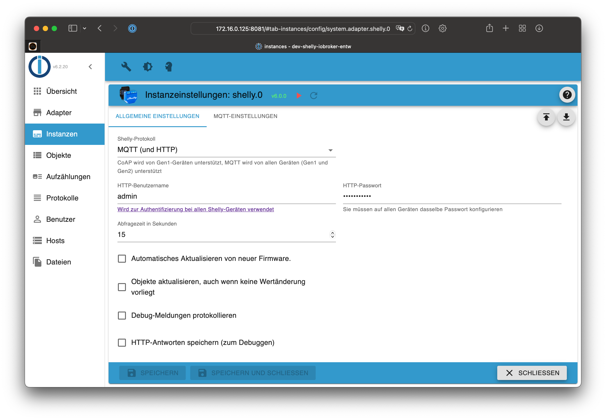

# ioBroker.shelly-ng

This is the German documentation - [🇺🇸 English version](../en/README.md)

## Inhaltsverzeichnis

- [MQTT Protokoll](protocol-mqtt.md)
- [Geschützter Login](restricted-login.md)
- [Zustandsänderungen](state-changes.md)
- [Debug](debug.md)
- [FAQ](faq.md)

## Anforderungen

1. Node.js 20 (oder neuer)
2. js-controller 6.0.0 (oder neuer)
4. Admin Adapter 7.4.10 (oder neuer)

Fragen? Schaue zuerst in die [FAQ](faq.md)!

