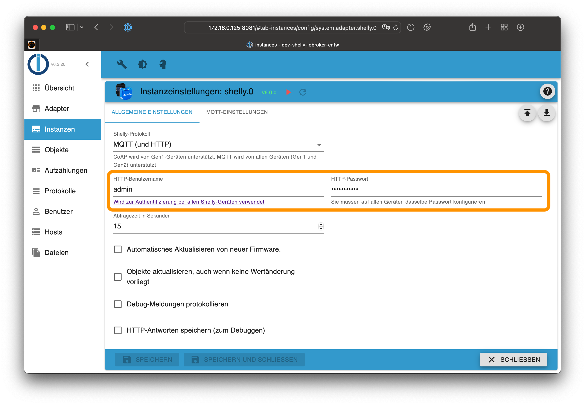

# ioBroker.shelly-ng
This is the German documentation - [🇺🇸 English version](../en/restricted-login.md)

## Geschützter Login
Um die Shelly-Geräte vor unbefugtem Zugriff zu schützen, setze in der ioBroker Konfiguration einen beliebigen Benutzernamen und Passwort im Tab *Allgemeine Einstellungen*.

Aktiviere danach den geschützten Zugriff auf allen Shelly-Geräten.

### Warnungen

Ist ein Geräte-Passwort im ioBroker konfiguriert, wird der Adapter Warnungen ins Log schreiben, falls einige Shelly-Geräte ungeschützt sind!

Um keine Warnungen mehr zu erhalten, kann entweder

- das Passwort in der Konfiguration des Adapters entfernt werden (= kein Passwort nötig) oder
- auf allen Shelly-Geräten der geschützte Zugriff aktiviert werden

### Generation 2 Geräte (Plus und Pro)

1. Öffne die Shelly-Webkonfiguration in einem Browser (nicht in der Shelly App!)
2. Gehe zu `Settings -> Authentication`
3. Aktiviere das Passwort-Feature und gib das gerade konfigurierte Passwort ein
4. Speichere die Konfiguration

