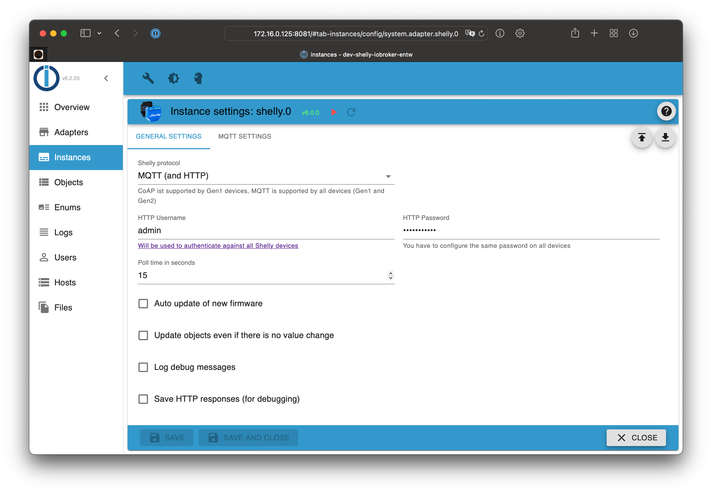

# ioBroker.shelly-ng

This is the English documentation - [🇩🇪 German version](../de/README.md)

## Table of contents

- [MQTT protocol](protocol-mqtt.md)
- [Restricted login](restricted-login.md)
- [State changes](state-changes.md)
- [Debug](debug.md)
- [FAQ](faq.md)

## Requirements

1. Node.js 20 (or later)
2. js-controller 6.0.0 (or later)
4. Admin Adapter 6.6.0 (or later)

Questions? Check the [FAQ](faq.md) section first!

