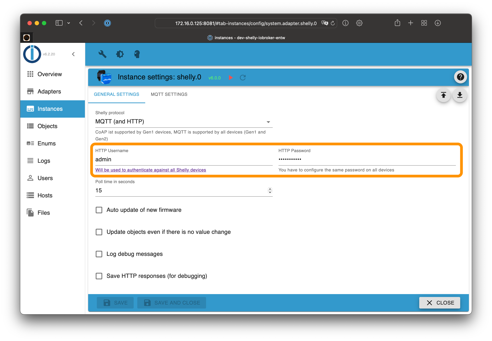

# ioBroker.shelly-ng

This is the English documentation - [🇩🇪 German version](../de/restricted-login.md)

## Restricted login

To protect your Shelly devices with a restricted login, choose a username and a password in the ioBroker configuration on the *general settings* tab.

Activate the login restriction on all your Shelly devices.

### Warnings

If a device password was configured in the ioBroker configuration, the adapter will raise warnings in the log when some Shelly devices are unprotected!

To avoid those warnings, you can

- remove the password from the ioBroker configuration (= no password required) or
- enable the restricted login on all Shelly devices with the configured password

### Generation 2 devices (Plus and Pro)

1. Open the Shelly web configuration in your webbrowser (not in the Shelly App!)
2. Go to `Settings -> Authentication`
3. Enable the authentication feature and enter the previously configured password
4. Save the configuration

